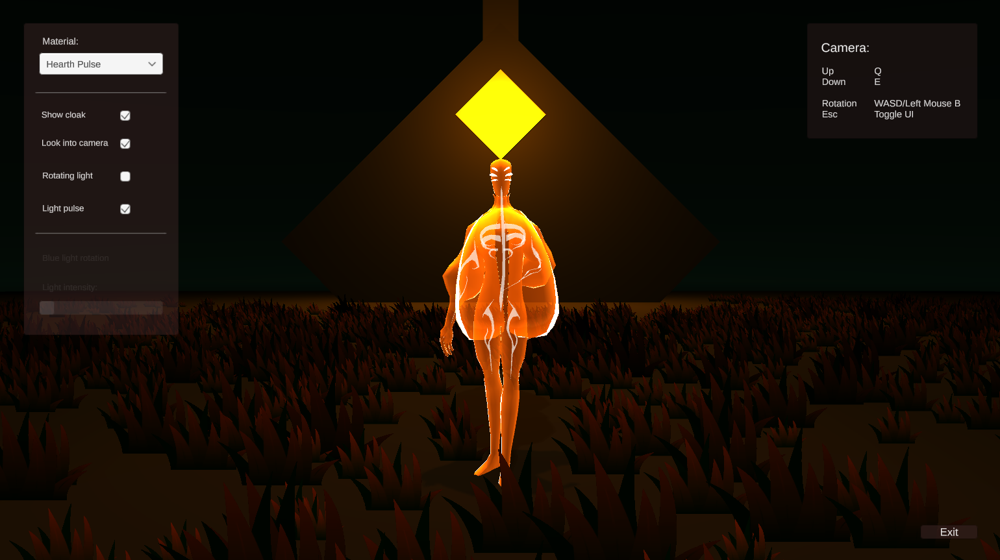
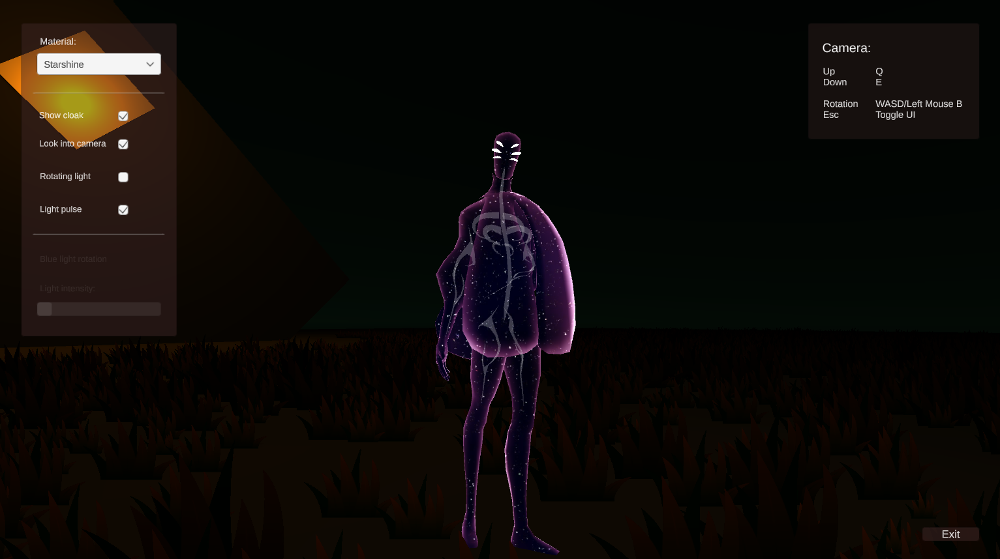
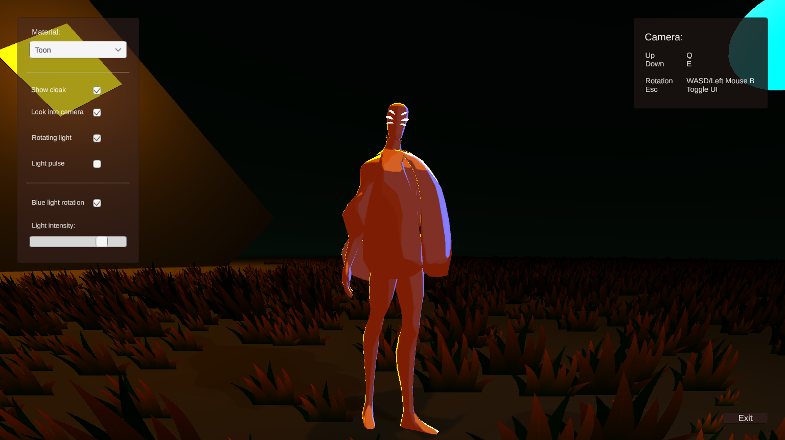
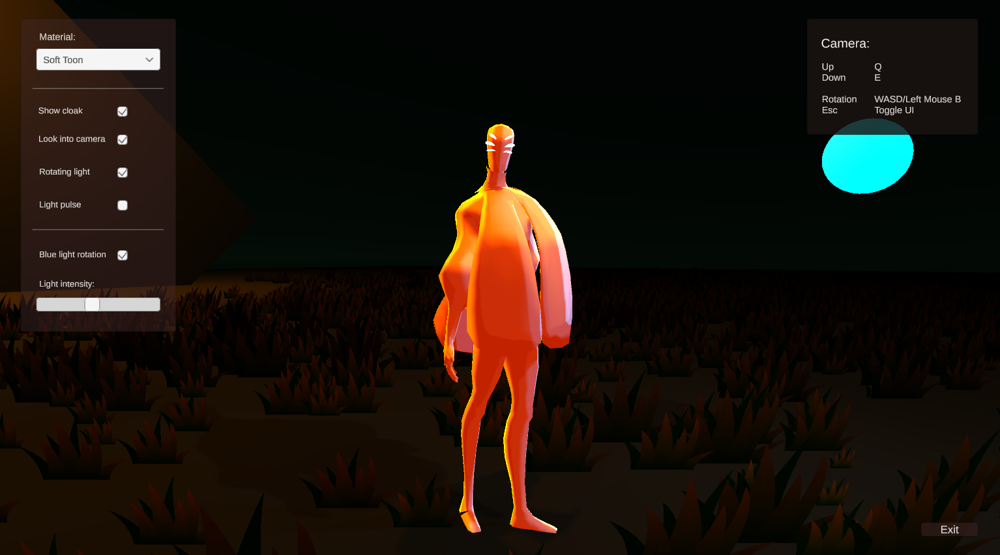
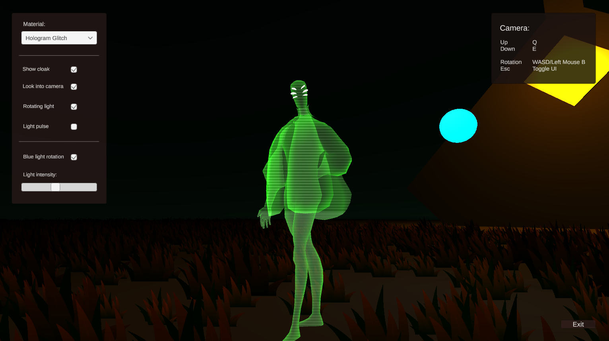
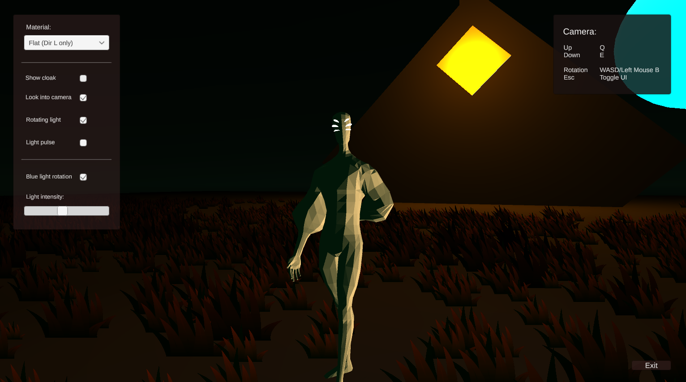

# TendersHearth
Unity project with simple scene setup to showcase one of six different shaders.

### 1) Hearth pulse
Transparent shader, alpha values change at same rate as the main light in the scene.

### 2) Starshine
Basic rim light effect on top of a screenspace texture.

### 3) Toon
Stepped lighting for toon effect, added rim light.

### 4) Soft toon
Similar to toon, except smoothstep for softer shadows.

### 5) Hologram glitch
Scrolling texture and vertex shader that occassionally "glitches".

### 6)
Flat shading, however it only works with the main directional light.

